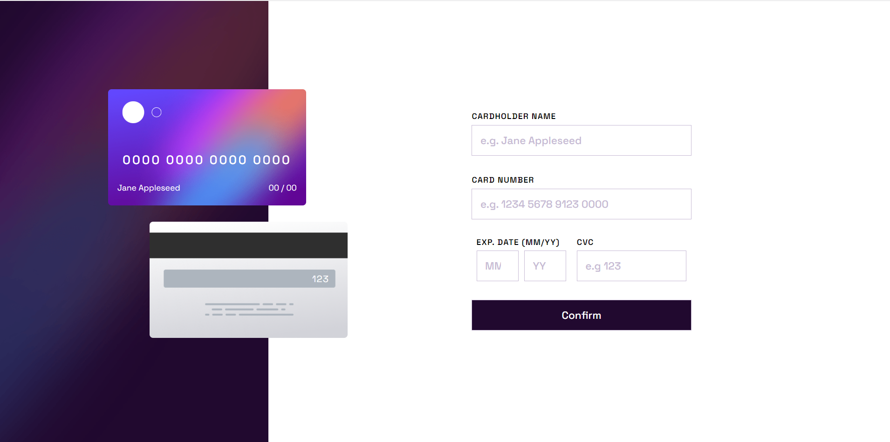
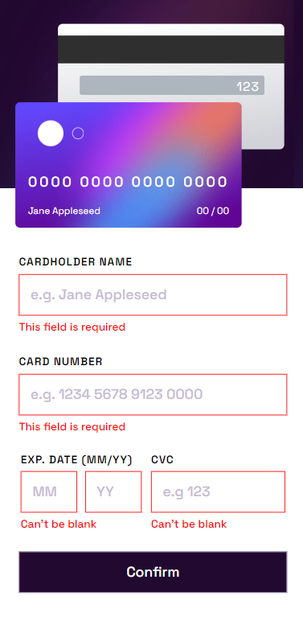

## Table of contents

- [Overview](#overview)
  - [Features](#features)
  - [Screenshot](#screenshot)
  - [Links](#links)
  - [Built with](#built-with)
- [Author](#author)
- [Acknowledgments](#acknowledgments)

**Note: Delete this note and update the table of contents based on what sections you keep.**

## Overview

### Features

The Interactive Card Details app is a user-friendly application designed to help users easily input their credit card information into a form and see the details displayed on a card image/simulation. The app is written in React with TypeScript and Sass, which makes it highly scalable, robust, and easy to maintain. The app is fully responsive and modern-looking.

The app has a simple and intuitive interface that guides users through the process of entering their card details into a form. As the user types in their card details, the card image/simulation updates in real-time to reflect the changes made. This gives users a clear and visual representation of the card they are entering their details for.

The app has also been designed to have intuitive validation, ensuring that users input accurate and valid card details. If a user enters incorrect or incomplete information, the app will display an error message, prompting the user to correct their input.

In addition, the app comes with testing, which helps ensure that the app is functioning as intended and provides a high level of reliability. The app's testing ensures that all the features and functionalities of the app are working correctly, including the card image/simulation, form input, and validation.

### Screenshot

### Links

- Live Site URL: [Vercel](https://interactive-card-details-liart.vercel.app/)

### Built with

The app was built using a number of different technologies and tools, including:

- [Vite](https://vitejs.dev/): a fast build tool that allows for rapid development and quick feedback loops
- [TypeScript](https://www.typescriptlang.org/): a statically-typed superset of JavaScript that provides better code reliability and improved tooling
- [React](https://react.dev/): a popular JavaScript library for building user interfaces
- [Sass](https://sass-lang.com/): a preprocessor scripting language that extends CSS and provides more features and flexibility
- [Vitest](https://vitest.dev/): a testing library specifically designed for use with Vite and Vue applications
- [React Testing Library](https://testing-library.com/): a testing utility for React that allows for easy and efficient testing of UI components
- [React Hook Form](https://react-hook-form.com/): a third-party library for user from validation

## Author

Bozai Cosmin

## Acknowledgments

This is a solution to the [Interactive card details form challenge on Frontend Mentor](https://www.frontendmentor.io/challenges/interactive-card-details-form-XpS8cKZDWw).
